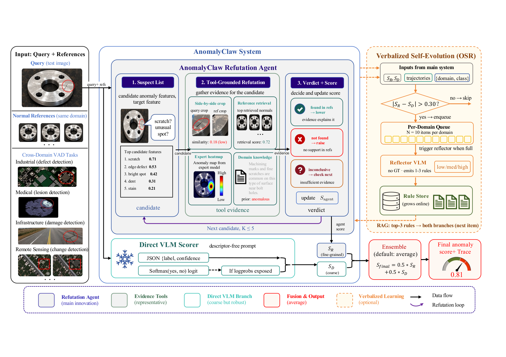
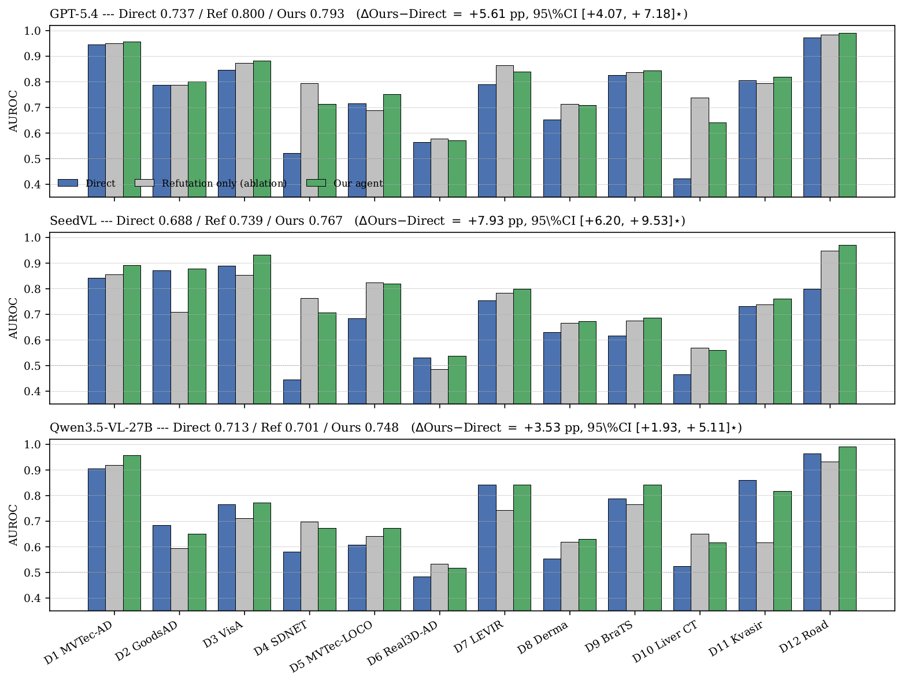

<div align="center">

# AnomalyClaw

### A Universal Visual Anomaly Detection Agent via Tool-Grounded Refutation

<!-- Replace with arXiv badge once submitted -->
[](LICENSE)
[](https://www.python.org/)
[](https://pytorch.org/)

**Xi Jiang**<sup>1</sup>, Yinjie Zhao<sup>2,3</sup>, Zesheng Yang<sup>1</sup>, Feng Zheng<sup>1†</sup>

<sup>1</sup> Department of Computer Science and Engineering, Southern University of Science and Technology, Shenzhen, China<br>
<sup>2</sup> School of EEE, Nanyang Technological University, Singapore &nbsp;&nbsp;
<sup>3</sup> CFAR, A\*STAR, Singapore<br>
<sup>†</sup> Corresponding author: `f.zheng@ieee.org`



</div>

## Abstract

Visual anomaly detection (VAD) arises across many real-world domains — industrial
inspection, medical imaging, road-scene safety, infrastructure monitoring,
remote-sensing change detection — each with its own anomaly definition and
modality, so per-domain training rarely transfers. Vision-language models (VLMs)
applied *directly* conflate world-knowledge priors with task-specific anomaly
definitions and emit confident but wrong answers. We argue that VAD is a
compositional perception task: locate candidates, compare against normal
references, apply domain knowledge, and commit to a calibrated score. We
therefore present **AnomalyClaw**, a *training-free* VAD agent that judges
through **multi-turn refutation**. Each turn proposes candidate anomalies and
invokes a 13-tool catalog (visual inspection, reference understanding, frozen
expert probes) to refute each candidate against the references; the refutation
score is fused with a parallel Direct VLM judgment on the *same* backbone. On
our new **CrossDomainVAD-12** benchmark (12 domains, 1,418 test items),
AnomalyClaw delivers consistent macro-AUROC gains on every backbone — **+6.23 pp
on GPT-5.5**, **+7.93 pp on Seed2.0-lite**, **+3.52 pp on Qwen3.5-VL-27B**
($P(\Delta{>}0)>0.999$ for all). An optional verbalized self-evolution
extension generates the agent's own rulebook online with *zero oracle labels*.

## 🚧 News

- **2026-05** — Code, benchmark manifests, and pre-computed result tables released.
- *(under review)* — Paper submission.

## 🧠 Method

AnomalyClaw runs two parallel branches on the same VLM backbone and fuses their
scores:

```
                ┌──────────────────────────────────────┐
                │  Direct branch (one VLM call)        │
   item ──────► │  generic-descriptor anomaly score    │ ──► s_direct
   (refs+query) │                                      │
                ├──────────────────────────────────────┤
                │  Refutation branch (multi-turn)      │
                │  turn 1 : propose K candidate anomalies
                │  turn t : pick a tool, observe, refute
                │  turn N : commit final score          │ ──► s_refute
                └──────────────────────────────────────┘
                                  │
                                  ▼
                  anomaly_score = α·s_direct + (1-α)·s_refute     (α = 0.5)
```

**The 13-tool catalog** the refutation branch can invoke (`agent_tools_v8.py`):

| Family | Tools |
|---|---|
| Visual inspection | `side_by_side_compare`, `region_zoom`, `segment_anomaly` |
| Reference understanding | `reference_retriever`, `reference_profile`, `image_diff`, `rotate_align` |
| Frozen expert probes | `subspace_ad_score`, `anomaly_vfm_score`, `expert_heatmap` |
| Structure / texture | `blob_layout_viz`, `change_heatmap_viz`, `fft_spectrum_viz` |

Each tool carries an applicability annotation so the agent does not collapse
into a single primitive across domains. See `benchmark/scripts/AGENTS.md` for
the full v12 controller and refutation protocol.

## 📊 Benchmark — CrossDomainVAD-12

A 12-domain, reference-based VAD benchmark under a single per-image AUROC
protocol. Each domain contributes 20 / 40 / 120 items for
calibration / dev / test (D7 has 98 test); total 1,418 test items.

| ID | Domain | Source | Modality |
|:--:|:--|:--|:--|
| D1  | Industrial manufacturing | MVTec-AD | RGB |
| D2  | Complex industrial | VisA | RGB |
| D3  | Logical anomalies | MVTec-LOCO | RGB |
| D4  | 3D product | Real3D-AD (rendered) | RGB views |
| D5  | Retail products | GoodsAD | RGB |
| D6  | Infrastructure (concrete) | SDNET2018 | RGB |
| D7  | Remote-sensing change | LEVIR-CD+ | bi-temporal RGB |
| D8  | Dermatology | DermaMNIST | RGB |
| D9  | Brain MRI | BraTS 2021 | MRI slice |
| D10 | Liver CT | BMAD-Liver | CT slice |
| D11 | GI endoscopy | HyperKvasir | RGB |
| D12 | Road safety | BDD100K + RoadAnomaly21 | RGB |

Manifests are versioned in `benchmark/manifests_v2/`. Image paths use a
portable `{DATA_ROOT}/...` placeholder, resolved at load time via the
`ANOMALYCLAW_DATA` env var. See `DATA.md` for per-dataset download
instructions — we **do not redistribute raw images** because most upstream
licenses (e.g. MVTec) forbid it.

## 📈 Results

Macro AUROC on CrossDomainVAD-12 test (n = 1,418). $\Delta$ is the paired
bootstrap macro gain over single-pass *JSON-confidence* Direct on the same
backbone; 95% CIs are stratified paired bootstraps with 1,000 resamples.

| Backbone | Direct | **AnomalyClaw (Ours)** | $\Delta$ | 95% CI |
|:--|:--:|:--:|:--:|:--:|
| GPT-5.5            | 0.752 | **0.814** | **+6.23 pp** | [+4.84, +7.63] |
| Seed2.0-lite       | 0.688 | **0.767** | **+7.93 pp** | [+6.20, +9.53] |
| Qwen3.5-VL-27B     | 0.713 | **0.748** | **+3.52 pp** | [+1.93, +5.11] |

All $P(\Delta{>}0) > 0.999$ (0 / 1,000 bootstrap resamples $\le 0$).
A deployment variant reading Qwen's vLLM logprobs reaches **0.767** macro;
verbalized self-evolution adds another **+2.08 pp** on Qwen with zero oracle
labels. Per-domain breakdown:

<div align="center">

</div>

The full benchmark-table run outputs that back these numbers ship in
`benchmark/results/verbalized/v12_eval_test/` (1 JSON per domain × backbone).

## 📦 Installation

```bash
git clone https://github.com/jam-cc/AnomalyClaw.git
cd AnomalyClaw
python -m venv .venv && source .venv/bin/activate
pip install -r requirements.txt
```

Required: Python 3.10+, PyTorch 2.x, and an OpenAI-compatible VLM endpoint
(local vLLM or a hosted API). The agent itself has no neural training step.

## 🚀 Quick start

### 1. Fetch the raw images

```bash
export ANOMALYCLAW_DATA=$PWD/benchmark/data
mkdir -p "$ANOMALYCLAW_DATA"
```

Then follow the per-dataset table in `DATA.md` to populate
`$ANOMALYCLAW_DATA` (we ship manifests, retrieval indices, and expert score
caches in-repo — only the raw image folders need to come from upstream).

### 2. Bring up a VLM backend

```bash
# Local Qwen3.5-VL-27B via vLLM (the paper setup):
bash benchmark/scripts/launch_qwen35_replicas.sh
export QWEN_API_BASE=http://localhost:8210/v1
export QWEN_MODEL=Qwen3.5-VL-27B
export QWEN_API_KEY=EMPTY

# Or hosted GPT / SeedVL:
# export GPT_API_KEY=... GPT_API_BASE=...
# export SEED_API_KEY=... SEED_API_BASE=...
```

No API keys are baked into the code; each backend reads its own env vars.

### 3. Run the agent on one domain

```bash
python benchmark/scripts/agent_v12.py \
       --manifest benchmark/manifests_v2/D1_industrial_manifest.json \
       --split test \
       --backend qwen3 \
       --output benchmark/results/verbalized/v12_eval_test/D1.json \
       --max_turns 3 --max_workers 8 --resume
```

### 4. Or run the full reference sweep

```bash
bash benchmark/scripts/run_v12_eval_test.sh   # all 12 test domains
```

## ✅ Evaluation

Aggregate macro AUROC + paired-bootstrap CI from result JSONs:

```bash
python benchmark/scripts/evaluate.py \
       --pred benchmark/results/verbalized/v12_eval_test \
       --report-bootstrap
```

For the MMAD-MCQA fair-baseline numbers (paper §4.6):

```bash
python benchmark/scripts/mmad_eval_v12_mmad.py --help
```

## 🗂️ Repository layout

```
AnomalyClaw/
├── benchmark/
│   ├── BENCHMARK_SPEC.json            # CrossDomainVAD-12 spec
│   ├── manifests_v2/                  # 12-domain canonical manifests
│   ├── retrieval_index/D*_index.npz   # DINOv2 reference embeddings
│   ├── results/                       # paper-final result JSONs + expert caches
│   └── scripts/
│       ├── agent_v12.py               # canonical AD agent  ★
│       ├── agent_v12_mmad{,_mcq}.py   # MMAD-MCQA variants
│       ├── agent_v12_logitdirect.py   # logit-Direct deployment variant
│       ├── agent_prompt_v{9,10,12_mmad*}.py
│       ├── agent_tools_v8.py          # 13-tool catalog  ★
│       ├── infer.py                   # backend clients + image utils
│       ├── evaluate.py                # macro AUROC + bootstrap CI
│       ├── mmad_eval_v12_mmad*.py     # MMAD-MCQA evaluators
│       ├── baseline_*.py              # AnomalyDINO / VisualAD / AD-Copilot / IAD-R1
│       ├── expert_*.py                # SubspaceAD / AnomalyVFM wrappers
│       └── run_*.sh, launch_*.sh      # reproducer shells
└── experts/                           # upstream baseline clone targets (README only)
```

## 📄 License

Released under [CC BY-NC 4.0](LICENSE) — non-commercial use only. Third-party
datasets and expert baselines retain their original licenses.

## 📚 Citation

```bibtex
@article{jiang2026anomalyclaw,
  title   = {AnomalyClaw: A Universal Visual Anomaly Detection Agent via Tool-Grounded Refutation},
  author  = {Jiang, Xi and Zhao, Yinjie and Yang, Zesheng and Zheng, Feng},
  journal = {arXiv preprint},
  year    = {2026}
}
```

## 🙏 Acknowledgements

Built on top of [Qwen2.5/3.5-VL](https://github.com/QwenLM/Qwen-VL),
[DINOv2](https://github.com/facebookresearch/dinov2), and the public
[AnomalyVFM](https://github.com/maticfuc/anomaly_vfm),
[AnomalyDINO](https://github.com/dammsi/AnomalyDINO),
[SubspaceAD](https://github.com/) (and other baselines). We thank the MMAD
authors for the MCQA benchmark we use in §4.6.
